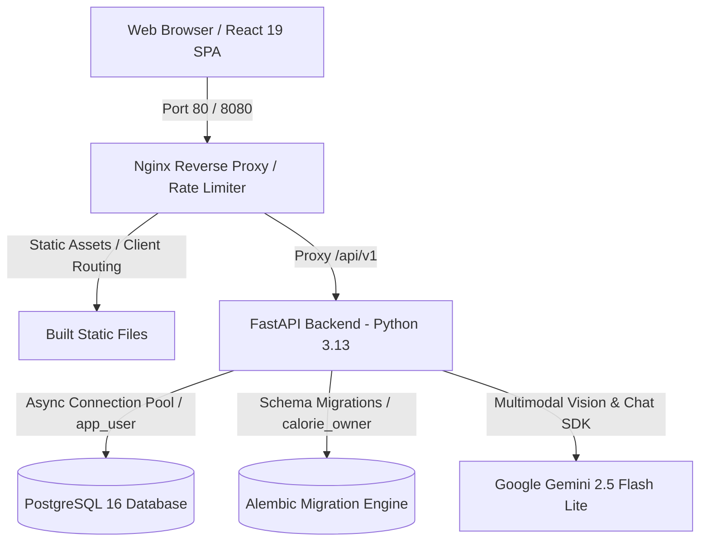
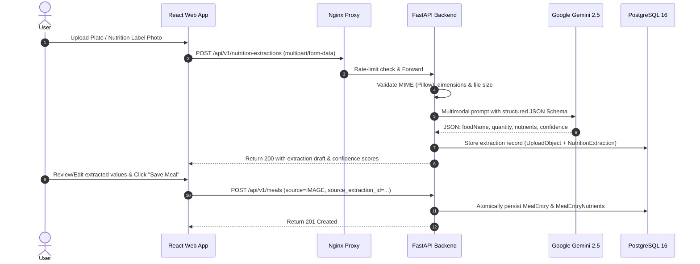
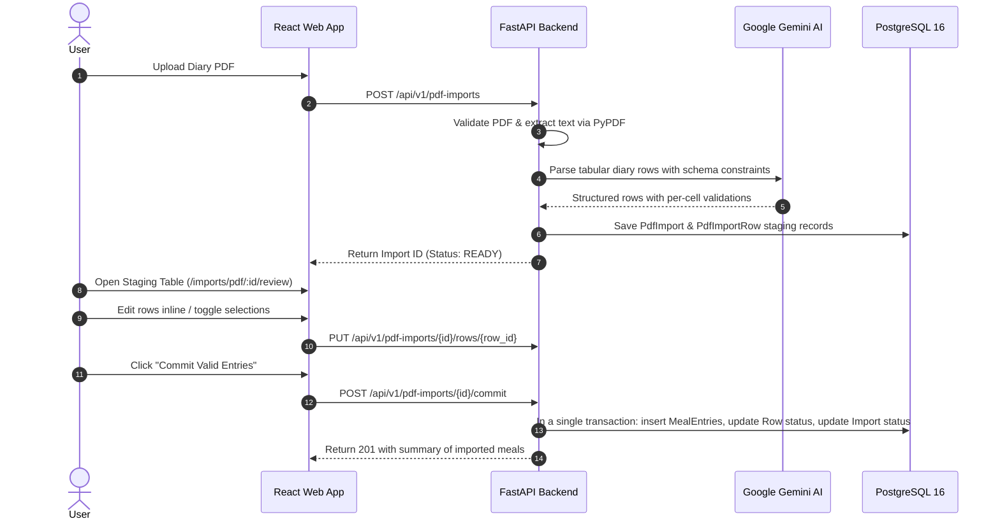
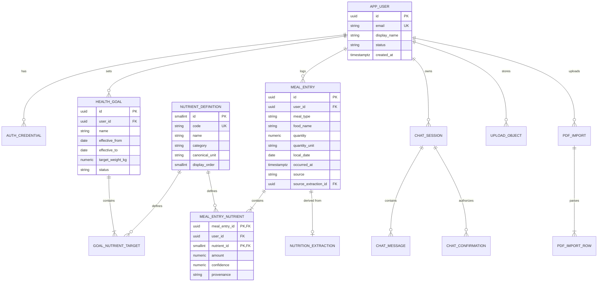

# Personal Calorie Tracker

[-FF9900?style=for-the-badge&logo=amazon-aws&logoColor=white)](http://13.233.90.9/)
[](https://fastapi.tiangolo.com)
[](https://react.dev)
[](https://www.postgresql.org)
[](https://ai.google.dev)
[](https://www.docker.com)
[](https://github.com)

> **Typeface Software Engineer Project Assignment**  
> A production-grade, full-stack nutritional intelligence and meal management application engineered with strict type safety, zero-trust tenant isolation, dual-role database security, and multimodal AI automation.

**Live Deployment**: [http://13.233.90.9/](http://13.233.90.9/)  
**Demo Video**: [demo_asset/screenrecording.mp4](./demo_asset/screenrecording.mp4)  
**Target Infrastructure**: AWS EC2 `t4g.small` (ARM64 Graviton2, Ubuntu 24.04 LTS)

---

## Table of Contents

- [Live Links & Demo Video](#live-links--demo-video)
- [Overview & Architecture](#overview--architecture)
- [Key Features & Assignment Requirements](#key-features--assignment-requirements)
  - [Core Requirements](#core-requirements)
  - [Bonus Features (Extra Credit)](#bonus-features-extra-credit)
- [System Architecture & Data Flow](#system-architecture--data-flow)
- [Database Design & Security Model](#database-design--security-model)
- [Technology Stack](#technology-stack)
- [API Reference](#api-reference)
- [Local Setup & Development Guide](#local-setup--development-guide)
  - [Prerequisites](#prerequisites)
  - [Quickstart with Docker Compose (Recommended)](#quickstart-with-docker-compose-recommended)
  - [Manual Local Development Setup](#manual-local-development-setup)
- [Production Deployment (AWS EC2)](#production-deployment-aws-ec2)
- [Assumptions, Trade-Offs & Invariants](#assumptions-trade-offs--invariants)
- [Code Quality & Verification](#code-quality--verification)

---

## Live Links & Demo Video

- **Live Production App**: [http://13.233.90.9/](http://13.233.90.9/)
- **Demo Video Walkthrough**: [Watch Walkthrough Video (`demo_asset/screenrecording.mp4`)](./demo_asset/screenrecording.mp4)
- **Sample Test Assets**:
  - Sample Food Image (AI Extraction test): [`demo_asset/Banana-Single.jpg`](./demo_asset/Banana-Single.jpg)
  - Sample PDF Food Diary (PDF Import test): [`demo_asset/sample-receipt.pdf`](./demo_asset/sample-receipt.pdf)
- **Deployment Server**: AWS EC2 `t4g.small` (Ubuntu 24.04 LTS, Graviton2 ARM64)

---

## Overview & Architecture

**Personal Calorie Tracker** is designed to eliminate the friction of nutritional logging and goal management. Built on modern software engineering principles, the system decouples client-side presentation from backend business logic and persistence, ensuring contract-driven API interactions, sub-second query latency, and reliable AI-assisted data entry.



### Core Architectural Pillars
1. **Contract-First & Decoupled**: The frontend communicates with the backend exclusively via versioned REST APIs (`/api/v1/*`) validated against an OpenAPI 3.1 schema.
2. **Dual-Role PostgreSQL Hardening**: The API operates using a non-privileged `app_user` (restricted to DML operations), while schema migrations run under a dedicated `calorie_owner` role.
3. **Multi-Tenant Row-Level Isolation**: Every transactional boundary is bound to `tenant_transaction(user_id)` with composite foreign keys `(id, user_id)` preventing cross-tenant data leaks.
4. **Resilient AI Pipeline**: Multimodal image processing, conversational interactions, and PDF extractions enforce concurrency semaphores, structured JSON schemas, confidence scoring, and idempotency guarantees.

---

## Key Features & Assignment Requirements

### Core Requirements

| Requirement | Implementation Details | Status |
| :--- | :--- | :---: |
| **Goal Setting** | Users define daily calorie targets, macronutrient targets (protein, carbs, fat, fiber, sugar), and micronutrient limits (vitamins & minerals) along with target body weight. Backed by PostgreSQL GiST exclusion constraints (`no_overlapping_active_goals`) ensuring no overlapping active goal periods. | Completed |
| **Meal Entry & Logging** | Categorize food entries across **Breakfast, Lunch, Dinner, and Snacks**. Supports custom portion sizes, quantity units, exact macro/micronutrient allocations, and source provenance tracking (`USER`, `LABEL_AI`, `PLATE_AI`, `PDF_AI`, `CHAT`). | Completed |
| **Time-Range Listing & Filtering** | Query meal history over customizable date ranges, filter by meal type, and paginate seamlessly using cursor-based pagination for high performance. | Completed |
| **Nutrition Reports & Graphs** | Interactive visual dashboards powered by Recharts: <br>• **Calorie Intake Trend**: 7-day / multi-week intake vs. target line.<br>• **Macronutrient Breakdown**: Daily/weekly protein, carb, and fat distribution.<br>• **Micronutrient Summary**: Radar & progress bars for 18+ vitamins and minerals.<br>• **Goal vs. Actual Comparison**: Direct delta tracking against active targets. | Completed |
| **AI-Powered Image Extraction** | Upload a photo of a **packaged nutrition label** or a **plate of food**. Google Gemini multimodal vision parses food name, serving size, calories, macros, and micros into a verified meal draft with confidence scores before saving. | Completed |

### Bonus Features (Extra Credit)

| Bonus Feature | Implementation Details | Status |
| :--- | :--- | :---: |
| **Conversational Chat Interface** | Natural language AI nutritionist powered by Gemini. Users can log meals conversationally (e.g., *"I had two scrambled eggs with toast and black coffee for breakfast"*), check goal progress, ask dietary questions, and receive weekly summaries. Generates structured meal drafts with one-click confirmation tokens (`ChatConfirmation` JTI). | Completed |
| **Multi-User Authentication** | Full user isolation supporting registration, login, token refresh, and logout. Protected by **Argon2id password hashing**, short-lived JWT access tokens, and HTTP-only secure refresh cookies. | Completed |
| **Bulk Import via PDF** | Upload PDF food logs or tabular nutrition exports. PyPDF extracts tabular streams and Gemini parses them into structured rows. Includes a **Staging & Review Workspace** (`/imports/pdf/:id/review`) where users can inspect, edit cells inline, resolve validation flags, and batch-commit meals in an atomic transaction. | Completed |

---

## System Architecture & Data Flow

### 1. AI Nutrition Extraction Pipeline


### 2. PDF Tabular Import & Review Workflow


---

## Database Design & Security Model

The database schema utilizes strict constraints, foreign keys with cascading boundaries, and indexed pagination cursors.



### Dual-Role Database Architecture

| Role Name | Purpose | Permissions |
| :--- | :--- | :--- |
| `calorie_owner` | Migration administrator for Alembic | DDL: `CREATE`, `ALTER`, `DROP`, `GRANT`, migration table management. |
| `app_user` | Runtime application identity | DML only: `SELECT`, `INSERT`, `UPDATE`, `DELETE` on operational tables. No schema modification privileges. |

---

## Technology Stack

### Backend (Python 3.13 / FastAPI)
- **Framework**: [FastAPI](https://fastapi.tiangolo.com/) + [Uvicorn](https://www.uvicorn.org/) (High-performance ASGI)
- **Database Access**: [SQLAlchemy 2.0 (Async)](https://docs.sqlalchemy.org/) + [asyncpg](https://github.com/MagicStack/asyncpg)
- **Schema Migrations**: [Alembic](https://alembic.sqlalchemy.org/) with automated seed scripts
- **AI / Multimodal Vision**: [Google GenAI SDK](https://github.com/googleapis/python-genai) (`gemini-2.5-flash-lite`)
- **Authentication**: [Argon2id](https://github.com/hynek/pwdlib) via `pwdlib`, [PyJWT](https://pyjwt.readthedocs.io/)
- **Data Validation**: [Pydantic v2](https://docs.pydantic.dev/) + `pydantic-settings`
- **File & Image Processing**: [Pillow](https://python-pillow.org/), [pypdf](https://pypdf.readthedocs.io/), [filetype](https://github.com/h2non/filetype.py)
- **Package Manager**: [Astral uv](https://github.com/astral-sh/uv) (ultra-fast dependency management)
- **Code Quality**: [Ruff](https://astral.sh/ruff) (Linter + Formatter), [mypy](https://mypy.readthedocs.io/) (Strict Type Checking)

### Frontend (React 19 / TypeScript / Vite)
- **Framework**: [React 19](https://react.dev/) + [TypeScript 5.9](https://www.typescriptlang.org/) + [Vite 7](https://vite.dev/)
- **Server State & Caching**: [TanStack React Query v5](https://tanstack.com/query)
- **Routing**: [React Router v7](https://reactrouter.com/)
- **Forms & Validation**: [React Hook Form](https://react-hook-form.com/) + [Zod](https://zod.dev/)
- **Visual Analytics**: [Recharts v3](https://recharts.org/)
- **Icons**: [Lucide React](https://lucide.dev/)
- **Styling**: Vanilla CSS Design Tokens (Responsive, zero-dependency, high-contrast, fully accessible)

### Infrastructure & Operations
- **Containerization**: Multi-stage Docker images (`python:3.13-slim`, `node:22-alpine`, `nginx:1.28-alpine`)
- **Reverse Proxy**: Nginx with custom rate-limiting zones (`/api/v1/auth/login`, `/api/v1/nutrition-extractions`), CSP headers, and HTTP keep-alive
- **CI / CD**: GitHub Actions validating Ruff, Mypy, ESLint, TypeScript compilation, Alembic full migration cycles, and Compose configs

---

## API Reference

All requests and responses use standard JSON wrapping under `/api/v1`.

### Authentication & Profile
- `POST /api/v1/auth/signup` — Register a new user account with email, password, and display name.
- `POST /api/v1/auth/login` — Authenticate and receive a short-lived access token + HTTP-only refresh cookie.
- `POST /api/v1/auth/refresh` — Refresh access token using secure cookie rotation.
- `POST /api/v1/auth/logout` — Revoke active session.
- `GET /api/v1/profile` — Fetch current user profile.
- `PUT /api/v1/profile` — Update user details and preferences.

### Health Goals
- `GET /api/v1/goals/current` — Retrieve active health goal and target macro/micronutrient quotas.
- `GET /api/v1/goals` — List historical goals (paginated).
- `POST /api/v1/goals` — Create a new health goal (automatically closes overlapping active goal windows).
- `PUT /api/v1/goals/{id}` — Update or archive a specific goal.
- `DELETE /api/v1/goals/{id}` — Delete a goal entry.

### Meals & Nutrition
- `GET /api/v1/meals` — List meal entries (filterable by `from_date`, `to_date`, `meal_type`, with cursor pagination).
- `GET /api/v1/meals/{id}` — Fetch details for a specific meal entry.
- `POST /api/v1/meals` — Create a meal entry with nutrient allocations.
- `PUT /api/v1/meals/{id}` — Update an existing meal entry.
- `DELETE /api/v1/meals/{id}` — Remove a meal entry.
- `GET /api/v1/nutrients` — Retrieve the canonical nutrient catalog (25 seeded vitamins, minerals, and macros).

### Reports & Analytics
- `GET /api/v1/reports/calorie-trend?from_date=...&to_date=...` — Daily calorie totals vs. goal target.
- `GET /api/v1/reports/macros?from_date=...&to_date=...` — Protein, carbohydrate, and fat breakdowns.
- `GET /api/v1/reports/micronutrients?from_date=...&to_date=...` — Comprehensive micronutrient intake summary.
- `GET /api/v1/reports/goal-comparison?from_date=...&to_date=...` — Goal vs. actual compliance metrics.

### AI Extraction, Chat & PDF Imports
- `POST /api/v1/nutrition-extractions` — Upload image file (`LABEL`, `PLATE`, or `AUTO`) for Gemini AI extraction.
- `GET /api/v1/nutrition-extractions/{id}` — Fetch cached extraction results.
- `POST /api/v1/chat/sessions` — Initialize a new conversational session.
- `GET /api/v1/chat/sessions` — List conversation history.
- `POST /api/v1/chat/sessions/{id}/messages` — Send a chat message; returns assistant response + optional meal draft.
- `POST /api/v1/pdf-imports` — Upload PDF food log for tabular extraction.
- `GET /api/v1/pdf-imports/{id}/rows` — List parsed staging rows with validation errors.
- `PUT /api/v1/pdf-imports/{id}/rows/{row_id}` — Edit an uncommitted staging row.
- `POST /api/v1/pdf-imports/{id}/commit` — Batch commit selected valid rows to meals table.

### System & Health
- `GET /api/v1/health/live` — Liveness probe (returns 200).
- `GET /api/v1/health/ready` — Readiness probe (verifies database connection pool).

---

## Local Setup & Development Guide

### Prerequisites
- [Docker](https://docs.docker.com/get-docker/) & [Docker Compose](https://docs.docker.com/compose/)
- *(Optional for manual setup)*: [Python 3.13+](https://www.python.org/), [uv](https://github.com/astral-sh/uv), [Node.js 22+](https://nodejs.org/), [PostgreSQL 16](https://www.postgresql.org/)

---

### Quickstart with Docker Compose (Recommended)

1. **Clone the repository**:
   ```bash
   git clone https://github.com/iamshobhraj/personal-calorie-tracker.git
   cd personal-calorie-tracker
   ```

2. **Configure Environment Variables**:
   Copy `.env.example` to `.env` and fill in your Gemini API key:
   ```bash
   cp .env.example .env
   ```
   *Edit `.env` and set:*
   ```env
   GEMINI_API_KEY=your_google_gemini_api_key_here
   ENABLE_CHAT=true
   ENABLE_PDF_IMPORT=true
   ```

3. **Start the complete stack**:
   ```bash
   docker compose up --build
   ```

4. **Access the Application**:
   - Web Application: [http://localhost:8080](http://localhost:8080)
   - Backend API Direct: [http://localhost:8080/api/v1/health/live](http://localhost:8080/api/v1/health/live)
   - Interactive Swagger API Docs: [http://localhost:8000/api/v1/docs](http://localhost:8000/api/v1/docs) *(when running API locally)*

---

### Manual Local Development Setup

#### 1. Backend (`apps/api`)
```bash
cd apps/api

# Install dependencies via uv
uv sync --all-groups

# Run database migrations
uv run alembic upgrade head

# Seed canonical nutrient catalogue
uv run python -m src.persistence.seeds

# Start development server with auto-reload
uv run uvicorn src.bootstrap.app:create_app --factory --host 127.0.0.1 --port 8000 --reload
```

#### 2. Frontend (`apps/web`)
```bash
cd apps/web

# Install dependencies
npm ci

# Start Vite development server with proxy to backend
npm run dev
```

---

## Production Deployment (AWS EC2)

The application is deployed on an **AWS EC2 `t4g.small` instance** (ARM64 Graviton2) at [http://13.233.90.9/](http://13.233.90.9/).

### Production Hardening Features
- **Container Isolation**: Multi-container setup running as non-privileged users (`app:app` and `nginx`).
- **Resource Constraints**: Explicit memory caps (`backend: 640MB`, `postgres: 700MB`, `nginx: 192MB`) preventing out-of-memory cascades on 2GB RAM instances.
- **Kernel Security**: Containers run with `no-new-privileges:true`, read-only root filesystems, and dropped capabilities (`cap_drop: ["ALL"]`).
- **Nginx Protection**: Rate-limiting zones on sensitive endpoints (e.g. login brute-force defense at 30 req/min, image upload throttling at 10 req/min), body size limits (10MB for images, 15MB for PDFs), and strict CSP headers.

```bash
# Production deployment command on EC2 instance:
docker compose -f docker-compose.prod.yml up -d --remove-orphans
```

---

## Assumptions, Trade-Offs & Invariants

1. **Timezone & Local Date Handling**:
   - Meal entries capture both `occurred_at` (UTC timestamp) and `local_date` (User's calendar date) along with `entry_timezone` (e.g. `Asia/Kolkata`, `America/New_York`). This guarantees daily aggregation queries accurately reflect the user's local day without UTC date-shift distortion.

2. **Nutrient Precision & Unit Canonicalization**:
   - All nutrient quantities and targets use PostgreSQL `NUMERIC(14, 4)` and Python `Decimal` to avoid floating-point arithmetic errors.
   - Micronutrients are normalized into canonical SI units (`kcal`, `g`, `mg`, `mcg`) upon ingestion.

3. **Non-Overlapping Health Goals**:
   - Health goals enforce a PostgreSQL GiST exclusion constraint (`daterange(effective_from, COALESCE(effective_to, 'infinity'::date), '[)')`). Creating a new goal automatically updates previous goals to avoid ambiguous goal comparisons.

4. **AI Safety & Confirmation Boundaries**:
   - AI outputs from image extractions, conversational chat, and PDF imports **never write unverified data directly to the database**. All extractions produce structured staging drafts that require user confirmation or explicit review before persistence.
   - Chat action executions require short-lived cryptographic confirmation tokens (`ChatConfirmation` JTI).

5. **Idempotency on State Mutations**:
   - Key endpoints accept an `Idempotency-Key` header with database-backed caching, protecting against duplicate charges or double-logging caused by flaky network retries.

---

## Code Quality & Verification

The codebase maintains strict quality thresholds validated via continuous integration:

```bash
# 1. Backend Linting & Formatting Check (Ruff)
cd apps/api && uv run ruff check . && uv run ruff format --check .

# 2. Strict Static Type Checking (Mypy)
cd apps/api && uv run mypy src

# 3. Database Migration Round-Trip Verification
cd apps/api && uv run alembic upgrade head && uv run alembic downgrade base && uv run alembic upgrade head

# 4. Frontend ESLint & Typecheck
cd apps/web && npm run lint && npm run typecheck

# 5. Production Bundle Build Validation
cd apps/web && npm run build
```

---

## Author & Acknowledgments

- **Author**: Shobhraj
- **Assignment**: Typeface Full-Stack Software Engineer Project Assignment
- **Live Demo**: [http://13.233.90.9/](http://13.233.90.9/)
